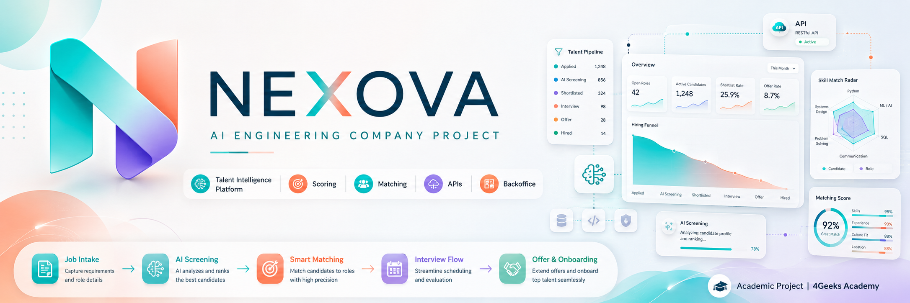

<p align="center">
  
</p>

# Nexova — AI Engineering Company Project

[](https://4geeksacademy.com)
[](https://4geeksacademy.com/es/programas-de-carrera/ingenieria-ia)

Monorepo del **proyecto de compañía** del programa AI Engineering de 4Geeks Academy.
La empresa elegida es **Nexova**, una consultoría de RR. HH. y adquisición de talento
(Valencia + Miami). Este repositorio reúne en un solo sitio todo lo construido a lo largo
del curso: la web pública, la lógica de negocio, el panel interno y las APIs.

> _Versión en español: [README.es.md](./README.es.md)._

---

## Project status

| Milestone | Entregable | Estado |
| --- | --- | --- |
| 0 — Choose your company | `company-choice.md` (Nexova) | ✅ |
| 1 — Web fundamentals | Web pública estática (`index.html`, `application.html`) | ✅ |
| 2 — Coding fundamentals (TS) | Motor de scoring/matching en `src/` | ✅ |
| 3 — Talent Pipeline Tracker | `uis/talent-pipeline-tracker` (Next.js) | ✅ |
| 4 — AI-driven Engineering | Monorepo + `uis/website` + `uis/backoffice` | ✅ |
| Supplier Directory (Lightweight Storage API) | `services/api` (FastAPI) + página `/suppliers` | ✅ |

Extras construidos sobre la base: **`services/talent-api`** (API de talento en Express/TS),
la **integración en vivo** del backoffice con esa API y la **vista de procesos** (pipeline).

---

## Architecture

```
                          ┌──────────────────────────────┐
                          │   uis/website  (Next.js)      │  Web pública de Nexova
                          └──────────────────────────────┘

   ┌──────────────────────────────┐        HTTP + CORS        ┌─────────────────────────┐
   │  uis/backoffice  (Next.js)   │ ───────────────────────▶ │ services/api (FastAPI)   │
   │  Panel interno               │   /suppliers             │ Supplier Directory       │
   │  · /            (KPIs)       │                          │ TinyDB + Pydantic  :8000 │
   │  · /processes   (pipeline)   │ ───────────────────────▶ ├─────────────────────────┤
   │  · /suppliers   (directorio) │   /candidates /reports   │ services/talent-api      │
   └──────────────────────────────┘                          │ Express + TS       :4000 │
                  :3000                                       └────────────┬────────────┘
                                                                           │ import @logic
   ┌──────────────────────────────┐        course API                     ▼
   │ uis/talent-pipeline-tracker  │ ──────────▶ playground.4geeks    ┌─────────────────┐
   │ (Next.js)                    │                                  │  src/  (TS)     │
   └──────────────────────────────┘                                  │  lógica Hito 2  │
                                                                     │  fuente única   │
                                                                     └─────────────────┘
```

La **lógica de negocio** (tipos, scoring, validaciones) vive una sola vez en `src/` y se
**importa** (alias TS `@logic`) desde el backoffice y la talent-api; nunca se copia.

---

## Directory guide

| Carpeta | Qué contiene |
| --- | --- |
| `src/` | Lógica de negocio compartida en TypeScript (Hito 2): tipos de dominio, motor de scoring, búsquedas, validaciones, datos de ejemplo. **Fuente única**, se importa vía `@logic`. |
| `uis/website/` | Web pública de Nexova en Next.js (Hito 4). |
| `uis/backoffice/` | Panel interno (Next.js): KPIs/ranking, pipeline de procesos y directorio de proveedores. Consume las APIs en vivo. |
| `uis/talent-pipeline-tracker/` | Tracker de candidatos (Hito 3) sobre la API del curso. |
| `services/api/` | **Supplier Directory API** — FastAPI + TinyDB + Pydantic, gestionada con `uv`. |
| `services/talent-api/` | API de talento (candidatos/vacantes/procesos/reportes) en Express + TS. |
| `memory-bank/` | Banco de memoria del proyecto (estado, contexto técnico, brief). |
| `.agents/` | Reglas y skills para el trabajo asistido por IA (Hito 4). |
| `index.html`, `application.html`, `validation.js` | Web estática original del Hito 1. |
| `agents/`, `data/`, `packages/`, `scripts/`, `infra/`, … | Andamiaje del monorepo (plantilla de 4Geeks); cada carpeta trae un `README.md` con su propósito para futuros hitos. |

---

## Quick start

Cada pieza se levanta por separado (los puertos son los que esperan las demás).

```bash
# Lógica compartida (Hito 2) — typecheck y demo
npm install
npm run typecheck
npm run demo

# Supplier Directory API (FastAPI, puerto 8000) — requiere uv
cd services/api
uv run seed                          # carga los 15 proveedores del CONTEXT (idempotente)
uv run uvicorn main:app --port 8000  # Swagger UI en http://localhost:8000/docs

# Talent API (Express, puerto 4000)
cd services/talent-api
npm install
npm run dev

# Backoffice (Next.js, puerto 3000) — consume las dos APIs anteriores
cd uis/backoffice
npm install
npm run dev

# Web pública y tracker (cada una en su carpeta)
cd uis/website                 && npm install && npm run dev
cd uis/talent-pipeline-tracker && npm install && npm run dev
```

> El backoffice usa `NEXT_PUBLIC_API_URL` (talent-api, por defecto `:4000`) y
> `NEXT_PUBLIC_SUPPLIERS_API_URL` (supplier API, por defecto `:8000`). Si una API no está
> arrancada, la vista muestra un estado de error con el comando para levantarla.

---

## Conventions & docs

- [`AGENTS.md`](./AGENTS.md) — flujo de trabajo, zonas protegidas y dónde va cada cosa.
- [`CONTEXT.md`](./CONTEXT.md) — briefing de la empresa (Nexova).
- [`memory-bank/progress.md`](./memory-bank/progress.md) — estado detallado y próximos pasos.
- [`.agents/rules/monorepo-conventions.md`](./.agents/rules/monorepo-conventions.md) — convenciones del monorepo.

---

_Construido como parte de los Coding Bootcamps de [4Geeks Academy](https://4geeksacademy.com)._
